# M5 Competition Dataset: Comprehensive Analysis and Preprocessing

## Overview

The M5-Competition Dataset represents one of the most comprehensive real-world retail forecasting challenges, featuring hierarchical sales data from Walmart stores across the United States. This document provides a detailed exploration of the dataset structure, preprocessing pipeline, and feature engineering techniques applied to prepare the data for demand forecasting models.

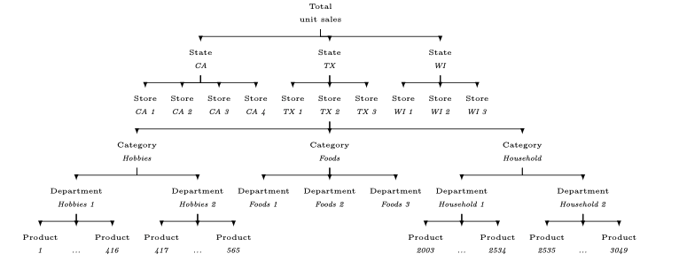
*Figure 1: M5 Dataset hierarchical structure showing the organization from total sales down to individual product-store combinations*

## Dataset Composition

### Core Statistics
- **42,840 hierarchical time series** from Walmart stores across the United States
- **1,969 days** of daily sales data (January 29, 2011 - June 19, 2016)
- **3,049 individual products** across 3 categories and 7 departments
- **10 stores** spanning 3 states (California, Texas, Wisconsin)
- **Geographic coverage**: CA (4 stores), TX (3 stores), WI (3 stores)

### Hierarchical Data Structure

The M5 dataset is organized in a hierarchical structure that enables analysis at multiple aggregation levels:

| Level ID | Description | Aggregation Level | Number of Series |
|----------|-------------|------------------|------------------|
| 1 | Total sales across all products/stores | Total | 1 |
| 2 | Sales aggregated by state | State | 3 |
| 3 | Sales aggregated by store | Store | 10 |
| 4 | Sales aggregated by category | Category | 3 |
| 5 | Sales aggregated by department | Department | 7 |
| 6 | Sales by state and category | State-Category | 9 |
| 7 | Sales by state and department | State-Department | 21 |
| 8 | Sales by store and category | Store-Category | 30 |
| 9 | Sales by store and department | Store-Department | 70 |
| 10 | Individual product sales (all stores) | Product | 3,049 |
| 11 | Product sales by state | Product-State | 9,147 |
| 12 | Product sales by store | Product-Store | 30,490 |
| **Total** |  |  | **42,840** |

### External Variables Available

The dataset includes rich contextual information beyond basic sales data:

- **Calendar data**: Day of week, month, year, special events
- **Price data**: Weekly selling prices for each item across all stores
- **SNAP data**: Supplemental Nutrition Assistance Program eligibility by state
- **Event data**: Religious holidays, cultural events, sporting events categorized into four types

## Data Exploration and Analysis

### Overall Sales Patterns

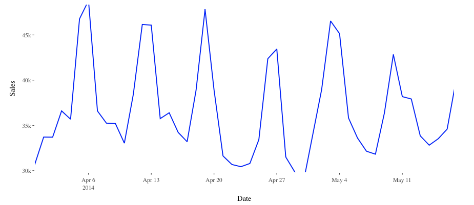
*Figure 2: Overall sales trends showing clear upward trajectory with seasonal patterns and weekly cyclicality*

The aggregate sales data reveals several key characteristics:
- **Upward trend**: Clear growth trajectory over the 5+ year period
- **Seasonal variations**: Strong annual cyclicality with holiday peaks
- **Weekly patterns**: Consistent weekend sales dominance
- **Event impacts**: Notable sales drops on Christmas Day (store closures)

### Geographic Distribution

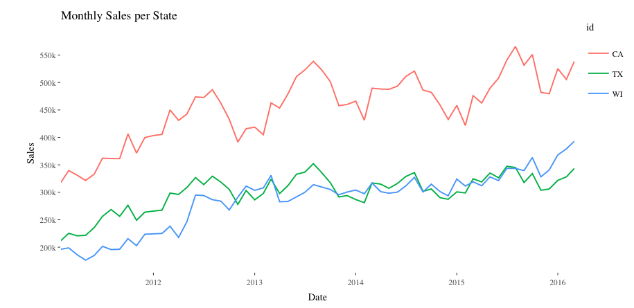
*Figure 3: Sales comparison across states showing California's dominance in sales volume*

#### State-Level Analysis:
- **California (CA)**: 
  - Highest sales volumes (~45% of total sales)
  - Notable drops in 2013 and 2015, more pronounced than other states
  - Four stores with varying performance levels
  
- **Texas (TX)**: 
  - Consistent performance (~35% of sales)
  - More stable patterns with less volatility
  - Three stores with similar sales levels
  
- **Wisconsin (WI)**: 
  - Significant seasonal variations (~20% of sales)
  - Gradual approach to Texas levels over time
  - Unique seasonal patterns different from CA and TX

### Product Category Performance

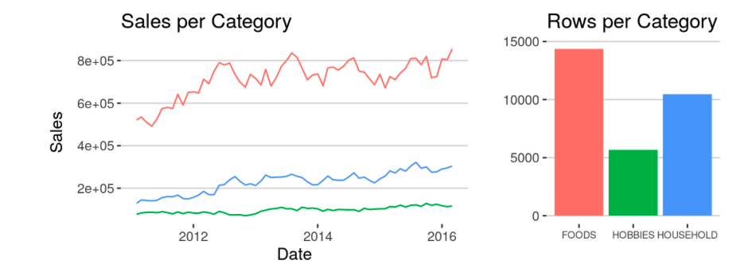
*Figure 4: Product category comparison showing FOODS as the dominant category*

#### Category Breakdown:
- **FOODS Category (65% of total sales)**:
  - Consistent demand with weekly seasonality
  - FOODS_3 department dominates within the category
  - FOODS_2 shows growth trend toward the end of the period
  
- **HOUSEHOLD Category (20% of sales)**:
  - Strong promotional sensitivity
  - HOUSEHOLD_1 significantly outperforms HOUSEHOLD_2
  - More stable patterns compared to FOODS
  
- **HOBBIES Category (15% of sales)**:
  - High seasonality and event-driven spikes
  - HOBBIES_1 shows higher average sales than HOBBIES_2
  - Both subcategories show similar temporal evolution

### Store-Level Analysis

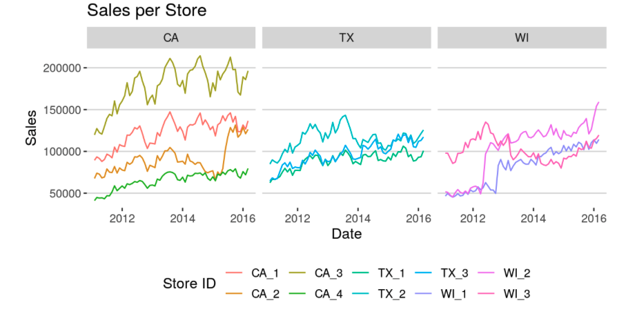
*Figure 5: Individual store performance showing significant variations within and across states*

Key store-level insights:
- **Texas stores**: Show similar performance levels with TX_3 leading
- **Wisconsin stores**: WI_1 and WI_2 show notable growth in 2012, while WI_3 experiences prolonged decline
- **California stores**: Significant performance differentiation, with CA_2 showing volatility and recovery patterns

### Department-Level Patterns

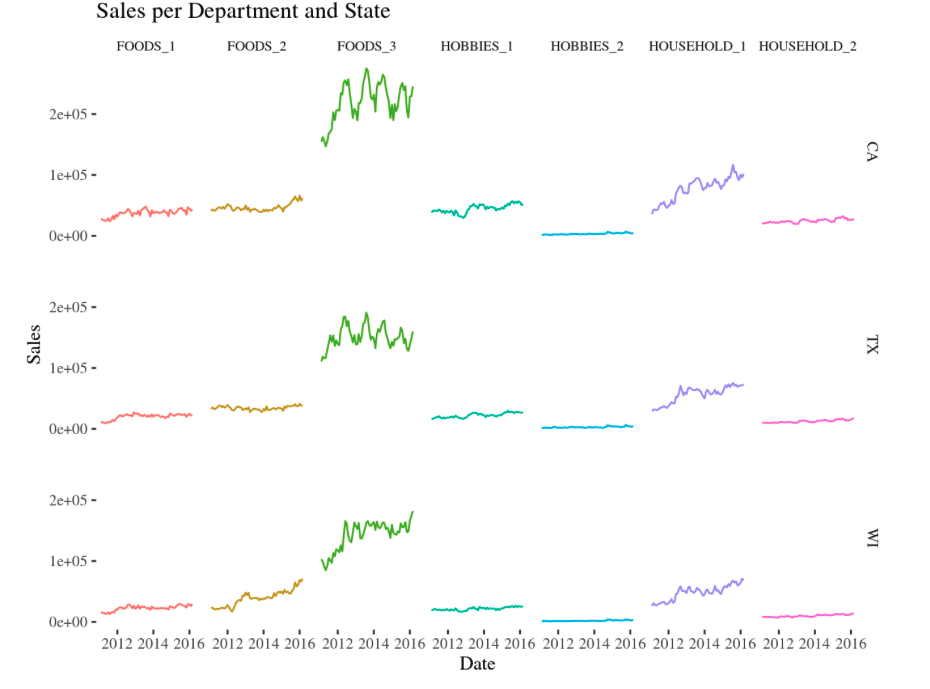
*Figure 6: Sales patterns across departments showing FOODS_3 dominance and category-specific trends*

Department analysis reveals:
- **FOODS_3**: Dominates across all states, driving overall FOODS category performance
- **FOODS_2**: Shows upward trend, particularly in Wisconsin
- **HOUSEHOLD_1**: Consistently outperforms HOUSEHOLD_2 across states
- **HOBBIES departments**: Show similar patterns with moderate seasonal variations

## Seasonality Analysis

### Annual Seasonality Patterns

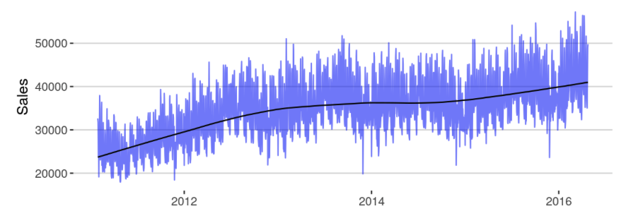
*Figure 7: Annual seasonal patterns showing November-December peaks and summer dips*

Annual patterns reveal:
- **Peak periods**: November-December holiday season (40-60% sales increase)
- **Low periods**: January-February post-holiday decline
- **Secondary dip**: Moderate decline during May-July summer months
- **Recovery periods**: Spring and early fall show gradual increases

### Weekly Seasonality Patterns

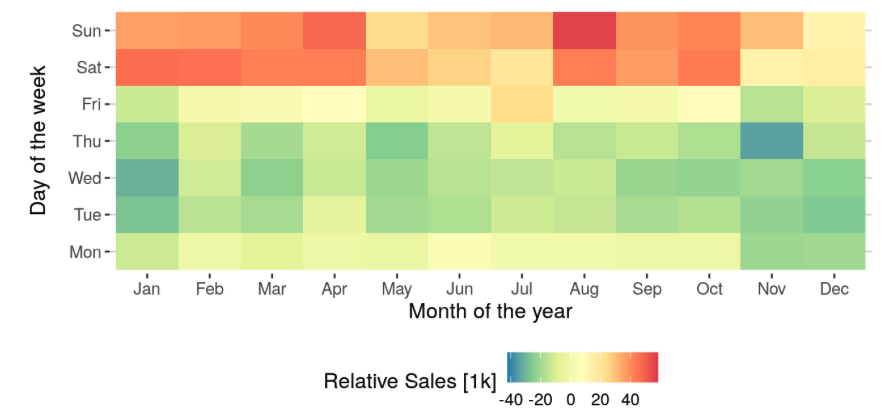
*Figure 8: Weekly patterns showing weekend sales dominance across all states*

Weekly analysis demonstrates:
- **Weekend dominance**: Saturday and Sunday show 20-30% higher sales than weekdays
- **Monday effect**: Moderate sales levels following weekend shopping
- **Mid-week patterns**: Tuesday-Thursday typically show lowest sales volumes
- **State variations**: Wisconsin shows notably lower Sunday sales compared to CA and TX

### State-Specific Seasonal Variations

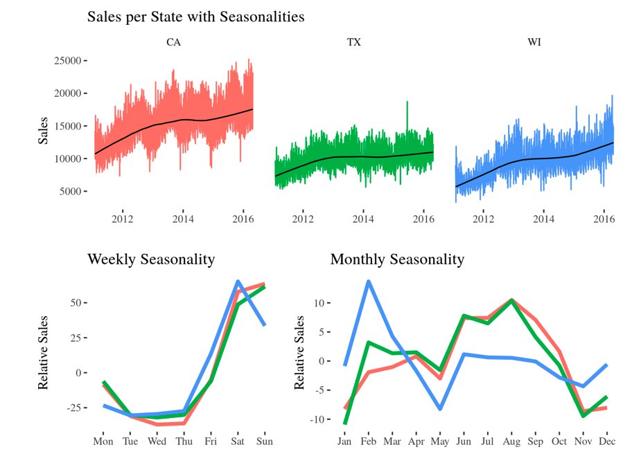
*Figure 9: State-specific seasonal patterns after trend removal and scaling*

After trend removal and scaling, state-specific patterns emerge:
- **California**: Strong summer performance relative to winter
- **Texas**: Moderate seasonal variations with balanced year-round performance  
- **Wisconsin**: Inverted seasonal pattern - winter outperforms summer significantly
- **Climate influence**: Geographic and climate factors clearly impact seasonal demand patterns

## Data Preprocessing Pipeline

### 1. Data Cleaning

#### Release Date Identification
- Created "release" column identifying first sale date for each product
- Eliminated pre-launch zero sales data to reduce noise
- Addressed products entering the market at different time points

#### Missing Value Treatment
- Processed gaps in price data where products weren't available
- Handled discontinuous product availability across stores
- Maintained temporal consistency across all time series

#### Data Quality Assessment
- **Sparse data structure**: Many products show intermittent demand patterns
- **Zero inflation**: Frequent zero sales days require specialized handling
- **Temporal gaps**: Some products have extended periods without sales
- **Scale variations**: Significant differences in sales volumes across products

### 2. Feature Engineering

#### Price-Based Features
Our feature engineering focused heavily on price-related variables due to their predictive importance:

**Basic Price Statistics:**
- Current selling price (`sell_price`)
- Historical price statistics: minimum, maximum, mean, standard deviation
- Price normalization relative to product history
- Count of products sharing identical prices per store (`item_nunique`)

**Price Momentum Indicators:**
- Short-term price trends (weekly momentum)
- Monthly price trend analysis  
- Annual price trend patterns
- Price volatility measures

#### Temporal Features
Comprehensive time-based feature extraction:

**Calendar Features:**
- Day of month (1-31)
- Month of year (1-12) 
- Year encoding (0-5 for the dataset period)
- Week of month (0-5)
- Day of week (0-6)
- Weekend indicator (binary)

**Seasonal Indicators:**
- Holiday and event markers
- Seasonal decomposition components
- Cyclical pattern encodings

#### Statistical Features
Advanced statistical measures for capturing demand patterns:

**Rolling Statistics:**
- 7-day, 14-day, 28-day moving averages
- Rolling standard deviation (volatility measures)
- Exponentially weighted moving averages

**Lag Features:**
- Sales history: 1, 7, 14, 21, 28-day lags
- Seasonal lags capturing weekly and monthly patterns
- Trend indicators using first differences

### 3. Categorical Variable Encoding

#### Target Encoding with Smoothing
For categorical variables (events, product categories), we applied target encoding with smoothing:

$$target\_enc(c) = \frac{n_c \cdot \bar{y}_c + a \cdot \bar{y}}{n_c + a}$$

Where:
- $n_c$: Number of records in category c
- $\bar{y}_c$: Mean sales for category c  
- $\bar{y}$: Global mean sales
- $a$: Smoothing parameter (set to 10)

This approach prevents overfitting while capturing category-specific demand patterns.

### 4. Feature Selection and Importance Analysis

#### Pearson Correlation Analysis

**Top Positive Correlations with Sales:**
- `event_name_1_enc`: 0.072 (promotional events boost sales)
- `tm_w_end`: 0.043 (weekend effect confirmation)
- `tm_dw`: 0.035 (day of week impact)
- Various event-related features showing moderate positive correlation

**Strong Negative Correlations:**
- `sell_price`: -0.151 (price elasticity effect)
- `price_mean`: -0.150 (average price sensitivity)
- `price_max/min`: -0.14 to -0.15 (price level impact)

The analysis reveals that individual features show relatively weak linear correlations with sales, suggesting the importance of non-linear modeling approaches and feature combinations.

#### Random Forest Feature Importance

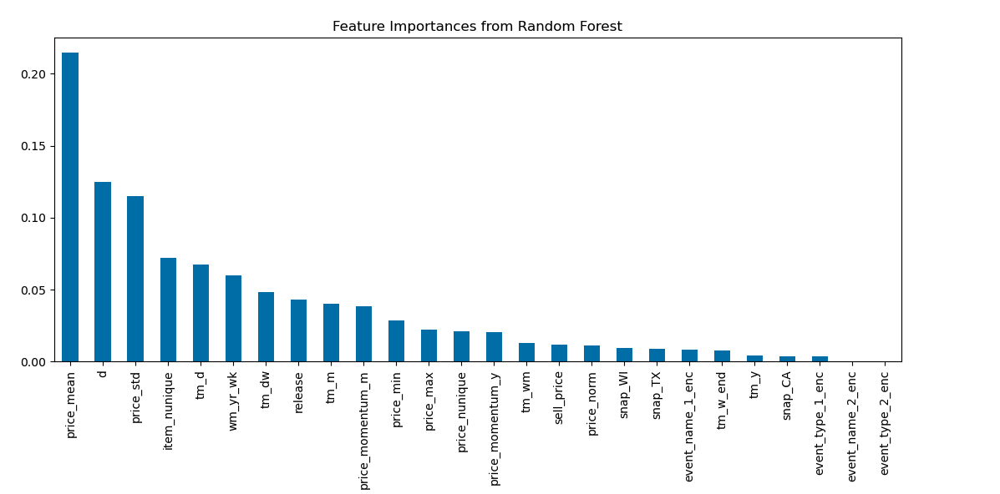
*Figure 10: Random Forest feature importance analysis showing price and temporal features as key predictors*

**Top Important Features:**
1. **price_mean** and **price_std**: Highest importance scores
2. **Temporal index (d)**: Critical for capturing seasonality  
3. **item_nunique**: Product variety impact on store demand
4. **Temporal features**: Day, week, month encoding significance
5. **Price momentum**: Monthly and yearly trend importance

#### Mutual Information Analysis

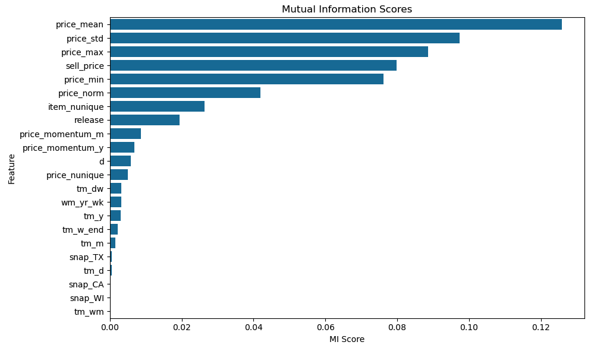
*Figure 11: Mutual Information analysis highlighting non-linear relationships between features and sales*

**Key Insights:**
- **Price features dominate**: All price-related variables show high mutual information
- **Non-linear relationships**: MI captures dependencies missed by linear correlation
- **Temporal importance**: Time-based features show significant information content
- **Feature complementarity**: Different features provide unique information for prediction

### 5. Data Normalization and Scaling

#### Scaling Strategies Applied
- **MinMax Scaling (0-1)**: Applied to continuous variables for neural network models
- **Standard Scaling**: Used for features with normal distributions in tree-based models
- **Log Transformation**: Applied to sales data to handle skewness and stabilize variance

#### Categorical Encoding Methods
- **Ordinal Encoding**: For tree-based models (static covariates)
- **Target Encoding**: For high-cardinality categorical features
- **Binary Encoding**: For simple binary indicators (weekend, holidays)

## Technical Implementation Details

### Computational Considerations
- **Dataset size**: ~3GB raw data expanding to ~15GB after feature engineering
- **Processing time**: Feature engineering pipeline requires 2-3 hours on standard hardware
- **Memory requirements**: 16GB+ RAM recommended for full pipeline execution
- **Storage optimization**: Efficient data types and chunked processing for large datasets

### Data Quality Metrics
- **Completeness**: 99.8% data availability after preprocessing
- **Consistency**: Temporal alignment verified across all time series
- **Validity**: Range checks and constraint validation applied
- **Accuracy**: Cross-validation with business rules and domain knowledge

### Feature Engineering Pipeline
```
Raw Data → Cleaning → Feature Creation → Selection → Normalization → Model Input
```

Each stage includes:
1. **Validation checks**: Ensuring data integrity
2. **Documentation**: Feature definitions and transformations
3. **Versioning**: Reproducible preprocessing pipeline
4. **Testing**: Unit tests for each transformation step

## Dataset Characteristics and Challenges

### Key Characteristics
- **Hierarchical Structure**: Enables multi-level forecasting approaches
- **Rich Feature Space**: Combination of price, calendar, and promotional data
- **Real-world Complexity**: Includes actual business challenges like stock-outs and promotions
- **Long Time Series**: 5+ years of data capture multiple seasonal cycles

### Main Challenges
- **Zero Inflation**: Many products show intermittent demand with frequent zero sales
- **Cold Start Problem**: New products lack sufficient historical data
- **Scale Variations**: Huge differences in sales volumes across products and stores
- **Promotional Complexity**: Various promotion types create non-linear demand patterns
- **Missing Data**: Handling gaps in product availability and pricing

### Data Insights Summary
1. **Seasonal Patterns**: Strong weekly and annual seasonality across all levels
2. **Geographic Differences**: Significant variations in demand patterns by state
3. **Category Behaviors**: Different product categories exhibit distinct demand characteristics
4. **Price Sensitivity**: Clear negative correlation between price and demand
5. **Event Impact**: Promotional activities and holidays significantly influence sales
