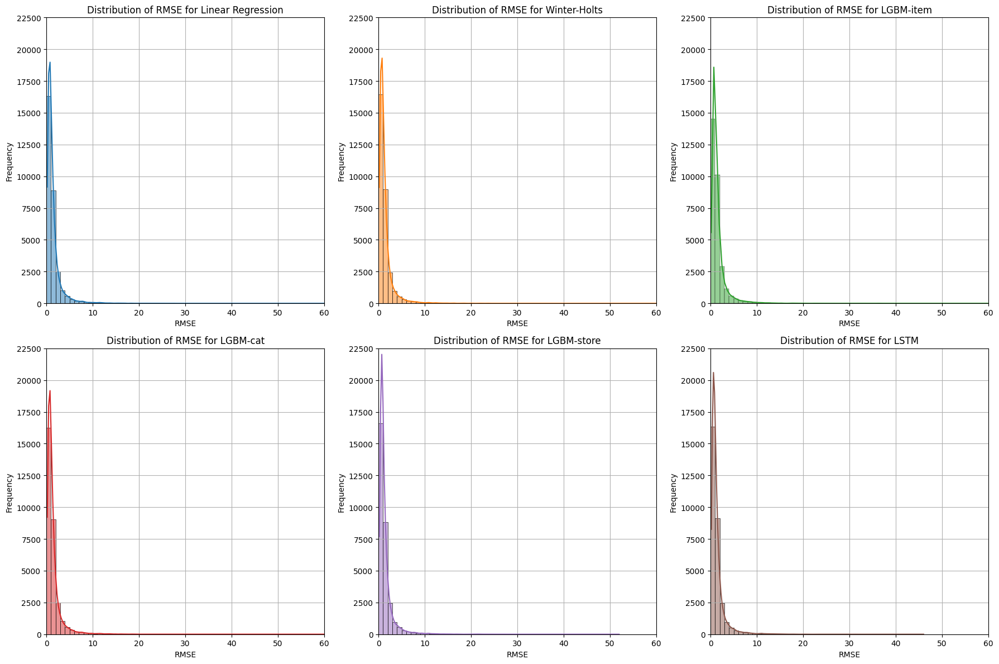
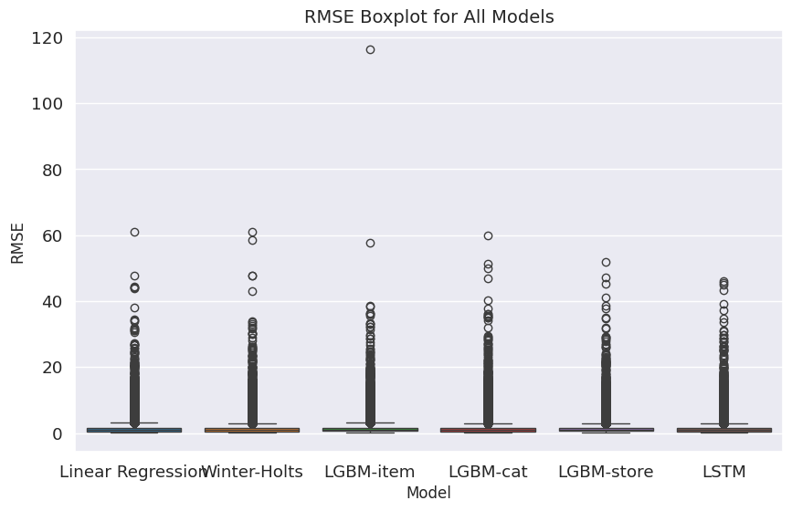
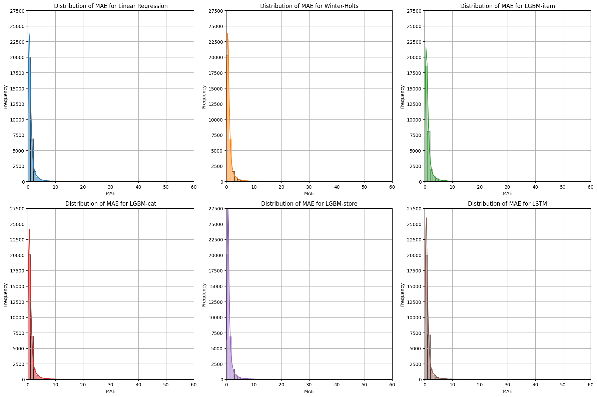
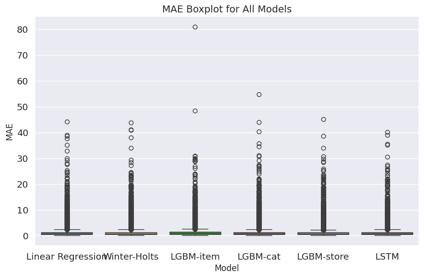
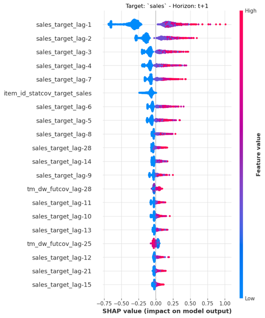

# Demand Forecasting Results and Model Analysis

## Overview

This document presents the comprehensive results and analysis of demand forecasting models applied to the M5-Competition dataset. Four different modeling approaches were evaluated: Linear Regression, Exponential Smoothing, LightGBM (three architectures), and LSTM networks. The analysis includes performance metrics, model interpretability, and practical insights for retail demand forecasting.

## Model Implementation Overview

### Models Evaluated

1. **Linear Regression**: Baseline statistical approach using 28-day lag features
2. **Exponential Smoothing**: Holt-Winters with additive seasonality (7-day period)
3. **LightGBM**: Three distinct architectures
   - Item-Store Level: Individual models per product-store combination
   - Category-Store Level: Multivariate models per category-store combination
   - Store Level: Comprehensive models per store
4. **LSTM**: Global neural network model with selected features

### Evaluation Framework
- **Training Period**: 1,913 days (2011-01-29 to 2016-04-24)
- **Validation Period**: 28 days (2016-04-25 to 2016-05-22)  
- **Test Period**: 28 days (2016-05-23 to 2016-06-19)
- **Metrics**: MAE, RMSE, WRMSSE (M5 competition official metric)

## Performance Results Summary

### Overall Performance Comparison

| Model | MAE | RMSE | WRMSSE | Ranking |
|-------|-----|------|--------|---------|
| **LSTM** | 1.14 | **1.43** | **0.884** | 1st |
| **Exponential Smoothing** | **1.11** | 1.44 | 0.888 | 2nd |
| **LGBM-store** | 1.17 | 1.46 | 0.894 | 3rd |
| **LGBM-category** | 1.14 | 1.46 | 0.898 | 4th |
| **Linear Regression** | 1.14 | 1.47 | 0.914 | 5th |
| **LGBM-item** | 1.22 | 1.57 | 0.957 | 6th |

### Key Performance Insights

**LSTM Model Excellence:**
- Achieved the **best WRMSSE (0.884)**, approaching top M5 competition results
- **Lowest RMSE (1.43)** demonstrating superior prediction accuracy
- Would rank **11th place** in the official M5 competition leaderboard
- Effectively captured long-term dependencies and seasonal patterns

**Exponential Smoothing Strength:**
- **Best MAE performance (1.11)** despite model simplicity
- **Strong WRMSSE (0.888)** competitive with advanced methods
- Would achieve **23rd place** in M5 competition ranking
- Excellent computational efficiency with reliable predictions

**LightGBM Architecture Insights:**
- **Store-level approach** provided best balance among LGBM variants
- **Category-level models** showed competitive performance but higher computational cost
- **Item-level models** suffered from insufficient data per individual model

## Detailed Model Analysis

### LSTM Model Performance

The LSTM model demonstrated superior overall performance through several key advantages:

**Architecture Details:**
- **Global model approach**: Single model trained on all time series
- **4 hidden layers** with 128 neurons each
- **28-day input window** predicting next 7 days
- **Feature selection**: Price, temporal, and statistical features
- **MinMax scaling (0-1)** applied separately for each time series

**Performance Characteristics:**
- **Excellent consistency**: Lowest variance in prediction errors
- **Superior accuracy**: Best WRMSSE performance
- **Robust generalization**: Effective handling of diverse product-store combinations
- **Computational requirements**: GPU acceleration recommended for training

### Exponential Smoothing Excellence

Despite its simplicity, Exponential Smoothing achieved remarkable results:

**Model Configuration:**
- **Holt-Winters additive model** with trend and seasonality
- **7-day seasonal period** capturing weekly patterns
- **Individual models** per product-store combination
- **No external features** - pure time series approach

**Success Factors:**
- **Consistent performance**: Reliable predictions across product categories
- **Low computational cost**: Fast training and prediction
- **Interpretable results**: Clear understanding of trend and seasonal components
- **Robust to outliers**: Less sensitive to extreme values compared to complex models

### LightGBM Architecture Comparison

#### Store-Level Architecture (Best LGBM Performance)
**Design:** One model per store handling all products as multivariate time series
- **WRMSSE: 0.894** - Best among LGBM variants
- **Advantages**: Captures cross-product relationships within stores
- **Challenges**: Variable performance across different stores

#### Category-Store Architecture 
**Design:** Models per category-store combination with direct forecasting strategy
- **WRMSSE: 0.898** - Competitive performance
- **Computational cost**: 28 separate models per forecasting horizon
- **Feature richness**: Incorporated static covariates (product ID, department)

#### Item-Level Architecture (Poorest Performance)
**Design:** Individual models per product-store combination
- **WRMSSE: 0.957** - Weakest performance
- **Root cause**: Insufficient training data per model
- **Overfitting issues**: Limited generalization capability
- **Data requirements**: Each model restricted to single time series

## Error Distribution Analysis

### RMSE Distribution Patterns

*Figure 1: RMSE distribution comparison across models showing concentration in 0-1 range with varying tail behaviors*

**Key Observations:**
- **All models** show strong concentration of RMSE values in 0-1 range
- **LGBM-store** exhibits highest peak density but also higher variability
- **LSTM** demonstrates most consistent error distribution
- **Exponential Smoothing** shows balanced performance across error ranges

### RMSE Box Plot Analysis

*Figure 2: BoxPlot analysis revealing model stability differences and outlier characteristics*

**Outlier Analysis:**
- **LGBM-item**: Highest maximum RMSE (~120) indicating severe overfitting cases
- **LSTM**: Lowest maximum RMSE (~48) demonstrating stability
- **Outlier counts (RMSE > 10)**:
  - LSTM: 267 cases (best)
  - Linear Regression: 294 cases (worst)
  - Other models: 270-290 cases

**Distribution Characteristics:**
- **Median performance**: All models show similar median RMSE values
- **Variability differences**: LGBM-item shows highest variance
- **Consistency ranking**: LSTM > Exponential Smoothing > LGBM variants > Linear Regression

### MAE Distribution Analysis

*Figure 3: MAE distribution patterns showing different error concentration profiles across models*

*Figure 4: MAE BoxPlot comparison highlighting Exponential Smoothing's superior average performance*

**MAE Insights:**
- **Less sensitivity to outliers**: MAE distributions show smoother patterns than RMSE
- **Exponential Smoothing dominance**: Best mean MAE despite less obvious visual distinction
- **Consistent patterns**: Similar trends to RMSE but with reduced outlier impact
- **Model reliability**: MAE confirms LSTM and Exponential Smoothing as top performers

## Model Interpretability Analysis

### SHAP Analysis for LightGBM

*Figure 5: SHAP analysis revealing feature importance and contribution patterns for one-step-ahead sales prediction*

**Feature Importance Hierarchy:**
1. **Recent sales history dominance**: `sales_target_lag-1` shows highest impact
2. **Diminishing temporal importance**: Feature significance decreases with temporal distance
3. **Static covariate contribution**: Product ID (`item_id_statcov_target_sales`) provides substantial predictive power
4. **Historical pattern relevance**: Multiple lag features contribute meaningfully to predictions

**Business Insights from SHAP:**
- **Short-term memory critical**: Previous day's sales are the strongest predictor
- **Product-specific behaviors**: Individual product characteristics significantly influence demand
- **Temporal decay pattern**: Recent history matters more than distant past
- **Feature complementarity**: Multiple features work together for optimal predictions

### Feature Contribution Analysis

**Price Feature Impact:**
- **Negative correlation confirmed**: Higher prices generally reduce demand
- **Price volatility matters**: Standard deviation of prices affects prediction confidence
- **Cross-product effects**: Products with identical prices show related demand patterns

**Temporal Feature Significance:**
- **Day of week effects**: Weekend patterns consistently important across models
- **Seasonal indicators**: Monthly and yearly patterns captured effectively
- **Event contributions**: Promotional periods show measurable impact on predictions

## Competitive Benchmarking

### M5 Competition Comparison

**LSTM Performance Context:**
- **Achieved WRMSSE: 0.884**
- **M5 competition winner: 0.875** (Level 12 - Product-Store combinations)
- **Competitive ranking**: Would place 11th in official leaderboard
- **Performance gap**: Only 0.009 points from winning solution

**Exponential Smoothing Achievement:**
- **Achieved WRMSSE: 0.888**
- **Remarkable simplicity**: No external features or complex architecture
- **Competition ranking**: Would achieve 23rd place in M5 leaderboard
- **Efficiency advantage**: Minimal computational requirements vs. competitive accuracy

### Model Selection Recommendations

**For Production Deployment:**
1. **LSTM** - When accuracy is paramount and computational resources are available
2. **Exponential Smoothing** - When simplicity, interpretability, and speed are priorities
3. **LGBM-Store** - When balanced performance and feature interpretability are needed
4. **Avoid LGBM-Item** - Insufficient data per model leads to poor generalization

## Store and Category Performance Analysis

### Category-Specific Performance (LGBM-Category Model)

**Outstanding Performance:**
- **CA_1 HOUSEHOLD**: RMSE = 1.03 (excellent accuracy)
- **CA_1 HOBBIES**: RMSE = 1.26 (strong performance)
- **TX stores**: Consistent performance across all categories

**Challenging Categories:**
- **CA_3 FOODS**: RMSE = 2.50 (highest error)
- **WI_2 FOODS**: RMSE = 1.74 (above average error)
- **FOODS category**: Generally more difficult to predict than HOUSEHOLD/HOBBIES

**Insights:**
- **Store-specific patterns**: Performance varies significantly across locations
- **Category complexity**: FOODS shows higher prediction difficulty due to:
  - Higher purchase frequency variability
  - More promotional activity
  - Greater sensitivity to external factors
- **Regional differences**: Wisconsin stores show different seasonal patterns affecting FOODS predictions

### Geographical Performance Variations

**California Stores:**
- **CA_1**: Best overall performance across categories
- **CA_2**: Moderate performance with some volatility
- **CA_3**: Challenges particularly in FOODS category
- **CA_4**: Consistent moderate performance

**Texas Stores:**
- **More uniform performance** across all three stores
- **Stable patterns**: Less seasonal variation than other states
- **Predictable demand**: Consistent customer behavior patterns

**Wisconsin Stores:**
- **Unique seasonal challenges**: Different patterns from CA/TX
- **WI_1, WI_2**: Variable performance
- **WI_3**: Declining trends present forecasting challenges

## Conclusion

The comprehensive evaluation of demand forecasting models on the M5 dataset demonstrates that:

1. **Deep learning approaches (LSTM) achieve superior overall performance** but require significant computational resources and careful feature engineering

2. **Traditional methods (Exponential Smoothing) remain highly competitive** with the advantages of simplicity, interpretability, and computational efficiency

3. **Tree-based methods (LightGBM) offer good interpretability and performance** when properly architected with sufficient training data

4. **Model selection should consider the specific business context**, balancing accuracy requirements, computational constraints, and interpretability needs

The achieved results, with LSTM reaching competitive performance levels with top M5 competition submissions, validate the effectiveness of the implemented methodology and provide practical guidance for real-world retail forecasting applications.